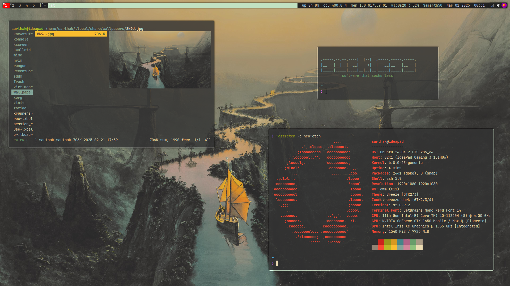

# suckless rice: Minimal Setup

A clean and minimal rice featuring dwm, slstatus, st, and rofi, enhanced with tmux, zsh, zinit, p10k, fzf, and just a wallpaper.

---

## 🖼️ Screenshot



---

## 🛠️ Installation

1. Clone the repo:
   ```bash
   git clone https://github.com/your-username/suckless-dots.git
   cd suckless-dots
   ```

2. Build and install:
   ```bash
   mv dwm slstatus st ~/.config/
   cd dwm && sudo make clean install && cd ..
   cd slstatus && sudo make clean install && cd ..
   cd st && sudo make clean install && cd ~/suckless-dots
   ```

3. Add to `.xinitrc`:
   ```bash
   mv .xinitrc ~/
   ```

4. Start:
   ```bash
   startx
   ```
---

Enjoy! 🚀
